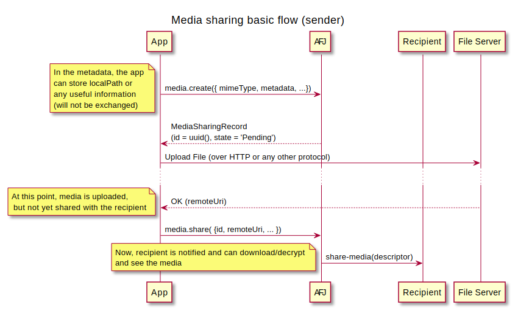
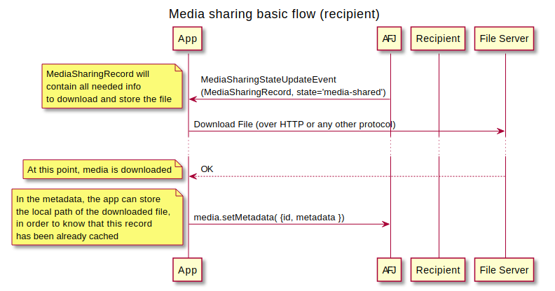

# Credo DIDComm Media Sharing extension module

This module is used to provide an DIDComm Agent built with [Credo](https://github.com/openwallet-foundation/credo-ts) means to manage [Media Sharing protocol](https://didcomm.org/media-sharing/1.0).

It's conceived as an extension module for Credo which can be injected to an existing agent instance:

```ts
import { MediaSharingModule } from 'credo-ts-media-sharing'

const agent = new Agent({
  config: {
    /* agent config */
  },
  dependencies,
  modules: { media: new MediaSharingModule() },
})
```

Once instantiated, media module API can be accessed under `agent.modules.media` namespace

## Usage

### Sending a media file



### Receiving a media file



> **TODO**
