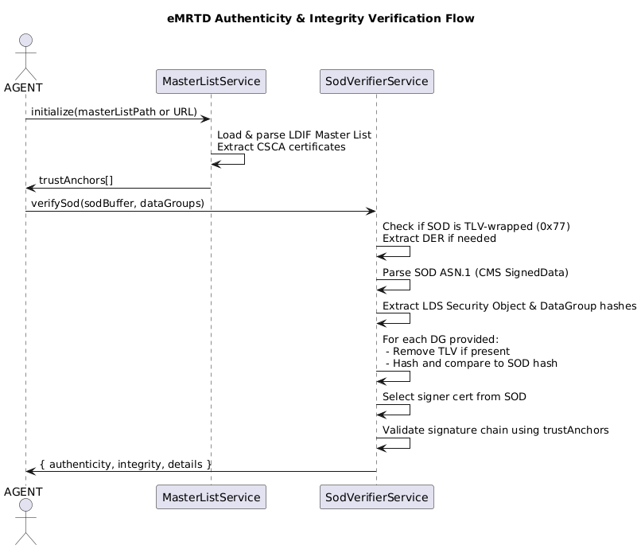

# eMRTD Authenticity & Integrity Verification

This module provides robust authenticity and integrity verification for electronic Machine Readable Travel Documents (eMRTD) such as passports and national ID cards, following [ICAO Doc 9303](https://www.icao.int/publications/pages/publication.aspx?docnum=9303) standards. It validates the EF.SOD signature and the hash values of all included Data Groups (DGs) using a trust store built from the official ICAO Master List (CSCA certificates).

---

## Features

- **ICAO Master List ingestion:** Load the Master List either from a local file path or by downloading it from a provided URL (LDIF format).
- **Automatic CSCA extraction:** Parses and loads all valid CSCA certificates into a trust anchor store for signature validation.
- **DER & TLV SOD parsing:** Seamlessly supports both raw DER and TLV-wrapped (0x77) SOD formats, as per ICAO LDS requirements.
- **Full integrity verification:** Checks that all present DGs (e.g., DG1, DG2) match their expected hash in the SOD.
- **Authenticity chain validation:** Verifies the document signer against the full CSCA chain, enforcing ICAO chain-of-trust requirements.
- **Comprehensive logging:** All steps are logged with clear context for traceability and audit.
- **Written with TypeScript/ES2019 best practices:** Thorough JSDoc, clear structure, and robust error handling.

---

## How It Works

### Overview

1. **Master List Load:** The module ingests the ICAO Master List in LDIF format (either from a URL or a file), extracts all CSCA certificates, and builds the trust store.
2. **Document Verification:**
   - Receives a JSON with all DG fields and EF.SOD, base64 encoded.
   - SOD is decoded and, if needed, the DER portion is extracted from a TLV envelope (0x77 tag).
   - The SOD’s ASN.1 structure is validated (CMS SignedData).
   - The LDS Security Object and all Data Group hashes are extracted from the SOD.
   - Each provided DG is hashed and compared to its corresponding SOD value.
   - The document signer certificate is validated against the CSCA chain from the trust store.

### Flow Diagram



---

## Usage Example

### Required Files

- **Master List (LDIF):** e.g. `csca-certs/icaopkd-002-complete-000317.ldif`
- **Document DGs & SOD (JSON):** e.g. `csca-certs/passport-1.txt`

### Example Test

```typescript
import * as fs from 'fs'
import * as path from 'path'
import { MasterListService } from './models/MasterListService'
import { SodVerifierService } from './models/SodVerifierService'

async function main() {
  // 1. Load Master List (file or URL)
  const masterListPath = path.resolve(__dirname, 'csca-certs/icaopkd-002-complete-000317.ldif')
  const passportFilePath = path.resolve(__dirname, 'csca-certs/passport-1.txt')

  // 2. Initialize trust anchors
  const masterListService = new MasterListService(masterListPath)
  await masterListService.initialize()

  // 3. Load and decode passport DGs and SOD (all base64)
  const passportJson = JSON.parse(fs.readFileSync(passportFilePath, 'utf8'))
  const passportData = passportJson.dataGroupsBase64 || passportJson

  if (!passportData.SOD) {
    throw new Error('The passport file does not contain the SOD field.')
  }

  const sodBuffer = Buffer.from(passportData.SOD, 'base64')
  const dg1Buffer = Buffer.from(passportData.DG1, 'base64')
  const dg2Buffer = passportData.DG2 ? Buffer.from(passportData.DG2, 'base64') : undefined

  const dgMap: Record<string, Buffer> = { DG1: dg1Buffer }
  if (dg2Buffer) dgMap.DG2 = dg2Buffer

  // 4. Perform verification
  const sodVerifier = new SodVerifierService(masterListService.getTrustAnchors())
  const result = await sodVerifier.verifySod(sodBuffer, dgMap)

  // 5. Output results
  console.log('Authenticity:', result.authenticity)
  console.log('Integrity:', result.integrity)
  if (result.details) {
    console.log('Details:', result.details)
  }
}

main().catch((err) => {
  console.error('Error in verification:', err)
})
```

#### Example JSON Format

```json
{
  "DG1": "<base64-encoded DG1>",
  "DG2": "<base64-encoded DG2>",
  "SOD": "<base64-encoded EF.SOD>"
}
```

Expected response:

```json
{
  "authenticity": true,
  "integrity": true,
  "details": null
}
```

---

## Notes on SOD and TLV Handling

- EF.SOD may be delivered as a TLV (tag 0x77), per ICAO LDS specification. The system auto-detects and extracts the inner DER CMS.
- You **do not need to pre-process** the SOD; simply provide the base64-decoded bytes as given by the document reader.
- Data Groups (DGs) can also arrive in TLV or DER — both are handled before hash computation.

---

## Output

- **Authenticity:** Indicates if the SOD signature is valid and trusted by any CSCA from the Master List.
- **Integrity:** Indicates if all provided DGs match their hashes as registered in the SOD.
- **Details:** Optional explanation for errors or mismatches.

---
